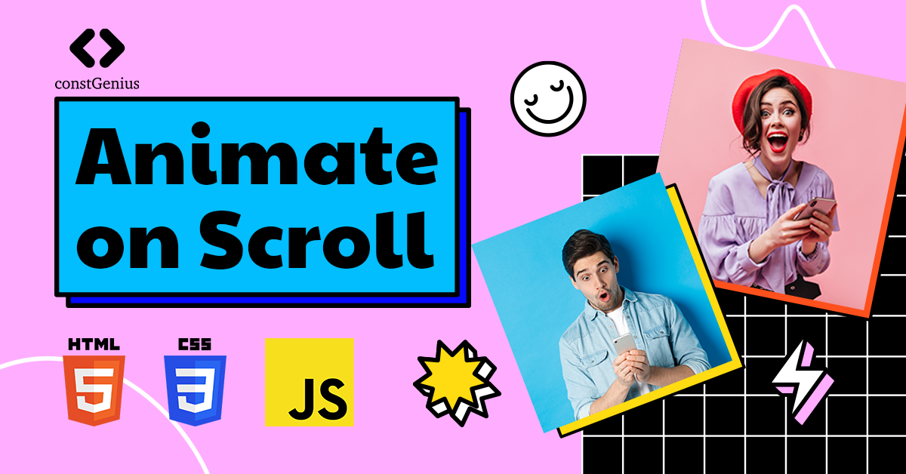

# Animate on Scroll

This comprehensive guide and project demonstrate how to implement captivating scroll-triggered animations on a webpage using the Intersection Observer API and the power of CSS animations. These scroll animations add a touch of interactivity and engagement to your web content, making it more visually appealing and memorable.

Youtube Tutorial Link: https://youtu.be/UYSylqXW9vM

Live Preview: https://constgenius.github.io/AnimateOnScroll/

