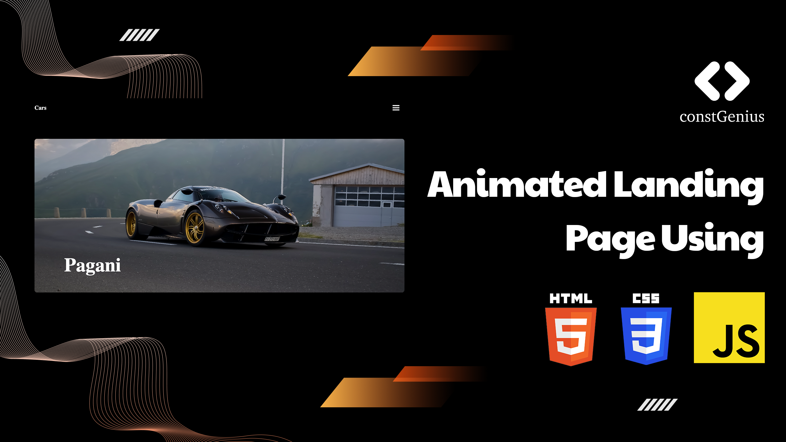

# Animated Landing Page | Animated Website Design Using HTML, CSS JavaScript | Modern Animation with GSAP

Live Preview: https://constgenius.github.io/AnimatedLandingPage/

Youtube Tutorial: https://youtu.be/Bf2JbLF_M8A

Creating a captivating Landing Page Animation using HTML, CSS, and JavaScript, with the help of GSAP (GreenSock Animation Platform), is a dynamic way to engage and delight website visitors. GSAP is a powerful animation library that allows for smooth, eye-catching transitions and effects that enhance the user experience.

With HTML, you structure the content and layout of the landing page, CSS brings style and design to the forefront, and JavaScript, in conjunction with GSAP, adds interactivity and animation. You can use GSAP's wide range of animations, such as fade-ins, slides, rotations, and more, to craft a visually appealing landing page that communicates your brand's message effectively.

This approach not only makes your landing page visually appealing but also provides a seamless and interactive experience for users, making it more likely that they'll engage with your content and take desired actions.

