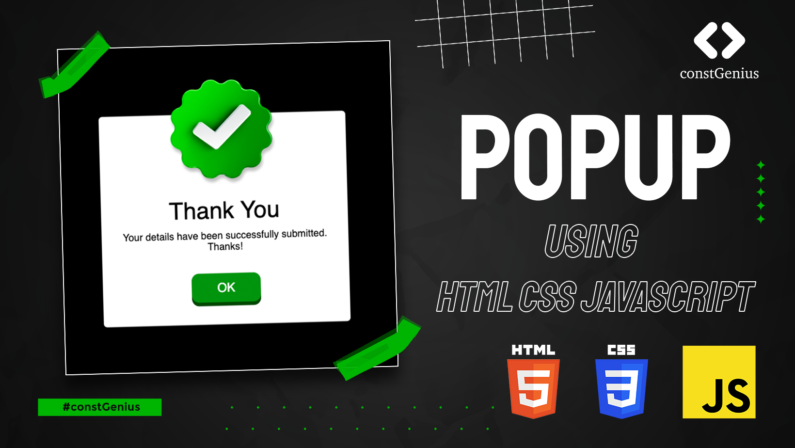

# Popup Using HTML CSS JavaScript | Modal Box in HTML Website

Crafted an engaging and visually appealing popup using the power of HTML, CSS, and JavaScript. This eye-catching popup captivates users, enticing them to click and explore additional content or exciting offers, creating an irresistible user experience.

Youtube Tutorial Link: https://youtu.be/nQ2DVbof3Cw

Live Preview: https://constgenius.github.io/Popup/

