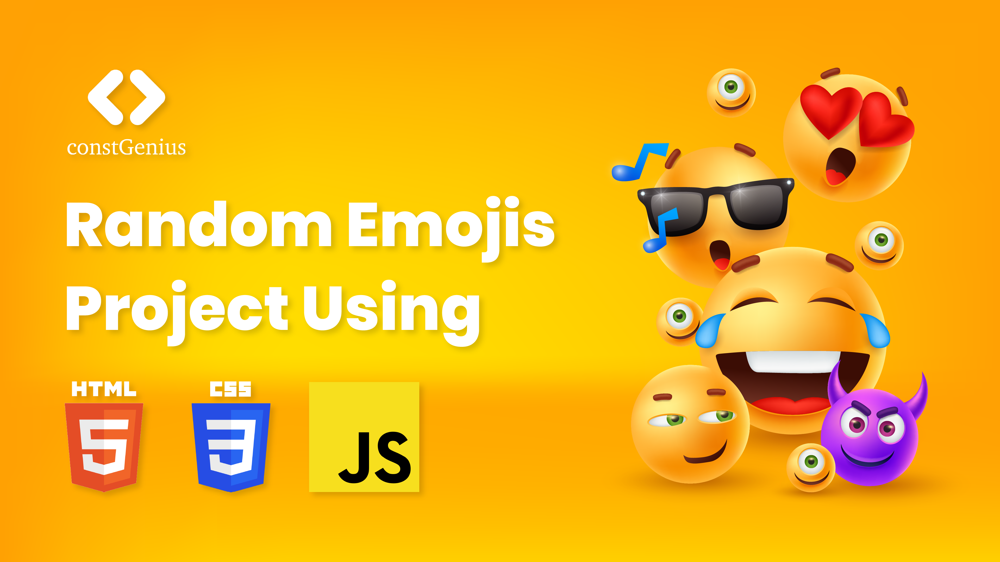

# Random Emojis Project Using JavaScript | HTML CSS JavaScript Project | Embrace the Joy of Randomness

The Random Emojis Project is a fun and interactive tutorial that guides you through creating a web application using HTML, CSS, and JavaScript. This project focuses on generating and displaying random emojis, bringing a touch of joy and unpredictability to your web page.

Youtube Tutorial Link: https://youtu.be/EhVD1KNpZwo

By using HTML for structure, CSS for styling, and JavaScript for logic, you will learn to build a responsive and visually appealing interface that randomly selects and displays emojis with each interaction. The tutorial covers key JavaScript concepts such as randomization, event handling, and DOM manipulation.

This project is perfect for beginners and those looking to add a playful element to their web development skills, making the learning process both enjoyable and educational.
