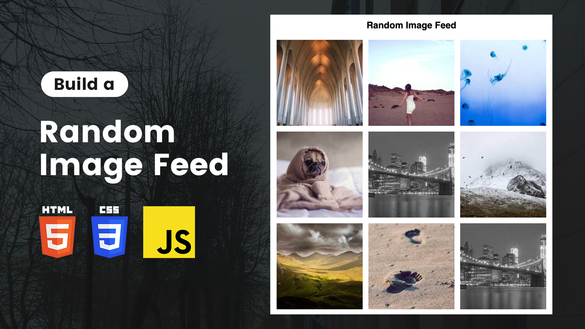

# Random Image Feed Using HTML CSS and JavaScript | HTML CSS JavaScript Project

The Random Image Feed tutorial demonstrates how to create an engaging and dynamic image gallery using HTML, CSS, and JavaScript. This project focuses on fetching and displaying random images, providing users with a constantly refreshing visual experience.

Youtube Tutorial Link: https://youtu.be/OeECZt6SKnU

Using HTML for the structure, CSS for styling, and JavaScript for fetching and updating images, you will learn how to build a responsive and interactive image feed. The tutorial covers essential concepts such as API integration, DOM manipulation, and responsive design.

Ideal for beginners and intermediate developers, this project offers a practical way to enhance your web development skills and create visually appealing content that keeps users engaged.
